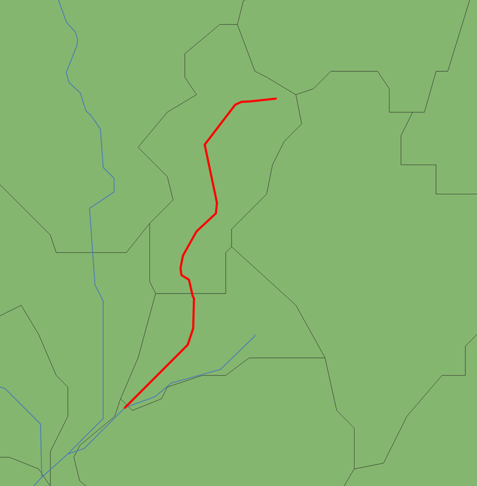
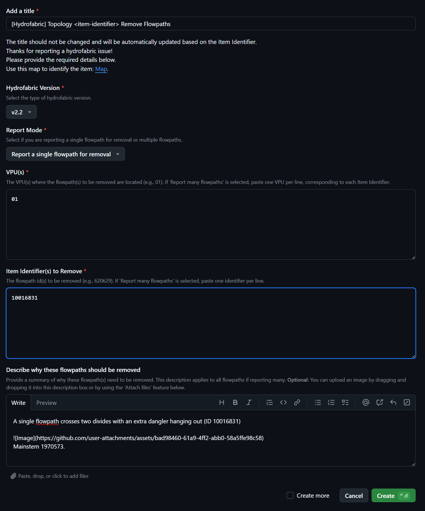
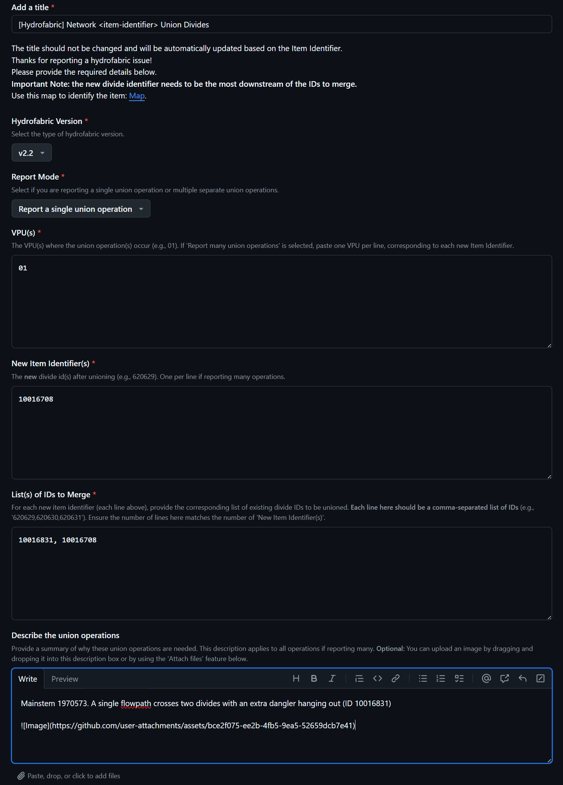
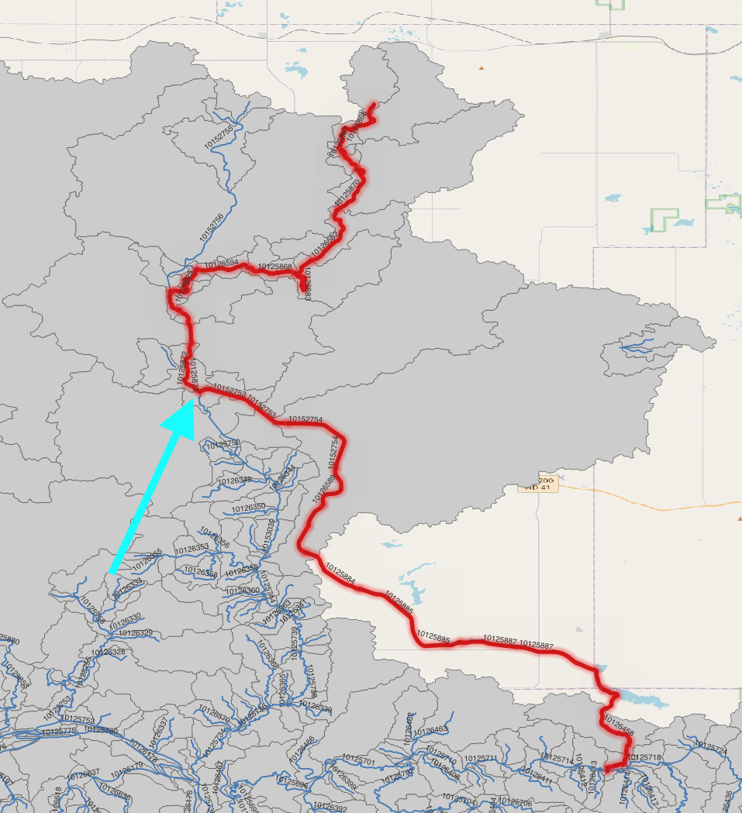
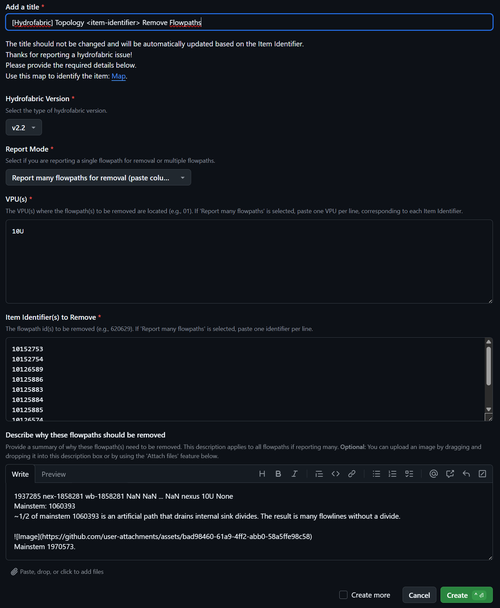
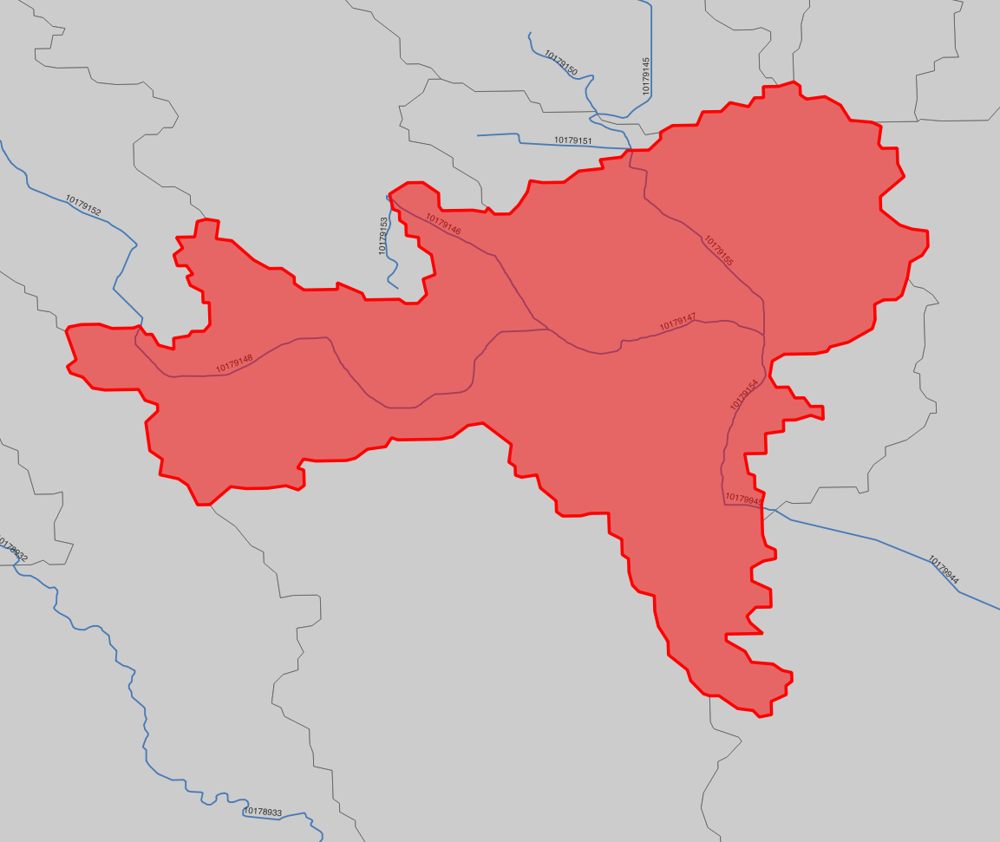
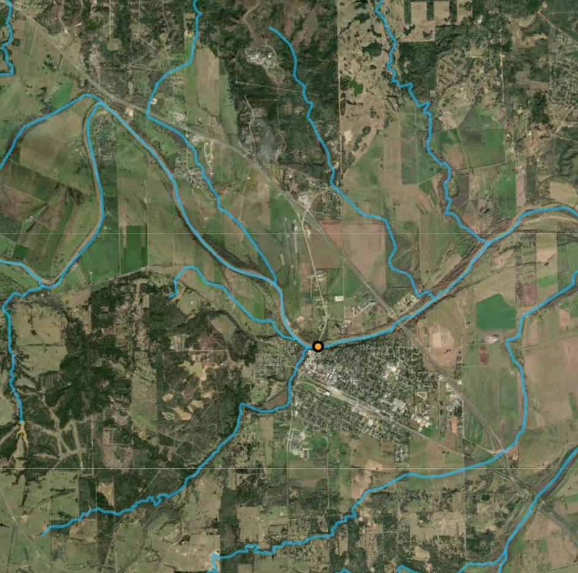

# Community Hydrofabric Issue Tracking

- [Flowpaths, Topo Fixes: ](https://github.com/lynker-spatial/Community_Hydrofabric/issues?q=is%3Aopen+is%3Aissue+label%3AHydrofabric-topo-fixes)
- [Flowpaths, Merge Flowpaths: ](https://github.com/lynker-spatial/Community_Hydrofabric/issues?q=is%3Aopen+is%3Aissue+label%3AHydrofabric-merge-flowpaths)
- [Flowpaths, Remove Flowpaths: ](https://github.com/lynker-spatial/Community_Hydrofabric/issues?q=is%3Aopen+is%3Aissue+label%3AHydrofabric-remove-flowpaths)
- [Divides, Reid Divide: ](https://github.com/lynker-spatial/Community_Hydrofabric/issues?q=is%3Aopen+is%3Aissue+label%3AHydrofabric-reid-divide)
- [Divides, Union Divides: ](https://github.com/lynker-spatial/Community_Hydrofabric/issues?q=is%3Aopen+is%3Aissue+label%3AHydrofabric-union-divides)
- [Hydrolocations, Hydrolocation Additions: ](https://github.com/lynker-spatial/Community_Hydrofabric/issues?q=is%3Aopen+is%3Aissue+label%3AHydrofabric-hydrolocation-additions)
- [Hydrolocations, Hydrolocations Adjustments: ](https://github.com/lynker-spatial/Community_Hydrofabric/issues?q=is%3Aopen+is%3Aissue+label%3AHydrofabric-hydrolocation-adjustments)
- [Data, Large Data Submission: ](https://github.com/lynker-spatial/Community_Hydrofabric/issues?q=is%3Aopen+is%3Aissue+label%3AHydrofabric-large-data-submission)

# Welcome to the Community Hydrofabric Issue Tracker!

This repository is the central hub for reporting, tracking, and managing issues related to the **Next Generation Water Resources Modeling Framework Hydrofabric**. We focus on geospatial data quality, network connectivity, and feature accuracy.

To ensure consistency and enable automation, we use **GitHub Issue Templates**. These templates guide you through providing all necessary information, which in turn helps us validate submissions and generate useful reports for the Hydrofabric team.

---

## Table of Contents

*   [Introduction](#-introduction)
*   [How It Works](#️-how-it-works)
*   [Identifying Features](#-identifying-features)
*   [Issue Types & Templates](#-issue-types--templates)
    *   [Flowpaths: Topo Fixes](#️-flowpaths-topo-fixes)
    *   [Flowpaths: Merge Flowpaths](#-flowpaths-merge-flowpaths)
    *   [Flowpaths: Remove Flowpaths](#-flowpaths-remove-flowpaths)
    *   [Divides: Reid Divide](#-divides-reid-divide)
    *   [Divides: Union Divides](#-divides-union-divides)
    *   [Hydrolocations: Hydrolocation Additions](#-hydrolocation-hydrolocation-additions)
    *   [Hydrolocations: Hydrolocation Adjustments](#-hydrolocation-hydrolocation-)
    *   [Data: Large Data Submission](#-data-large-data-submission)
*   [How to Report an Issue](#-how-to-report-an-issue)
    *   [Selecting the Right Template](#selecting-the-right-template)
    *   [Filling Out the Template](#filling-out-the-template)
    *   [Multi-Instance Reporting](#multi-instance-reporting)
    *   [Tips for Reporting](#tips-for-reporting)
*   [Tutorials](#-tutorials)
*   [Automation & Validation](#-automation--validation)
*   [CSV Export](#-csv-export)
*   [Additional Information](#-additional-information)

---

## Introduction

This repository is designed for the community to report specific geospatial issues within the Hydrofabric, including:

*   Incorrect or missing **flowpaths** and their connectivity.
*   Problems with **catchment divides** (e.g., incorrect IDs, necessary merges).
*   Issues with **hydrolocations** (Points of Interest, POIs) such as incorrect indexing to flowpaths or inaccurate coordinates.
*   Proposals for integrating **large external datasets**.

By using our structured issue templates, you help us gather precise information, which facilitates automated validation and allows the Hydrofabric team to efficiently address and integrate your feedback.

---

## How It Works

1.  **Report an Issue:** You select an appropriate template and fill in the required details.
2.  **Automatic Title Update:** The issue title will be automatically updated based on the primary identifier you provide.
3.  **Validation:** A GitHub Actions workflow automatically checks your submission for completeness based on the template's requirements. If issues are found, a comment is added to your issue.

---

## Identifying Features

To report issues accurately, you'll often need to identify specific hydrofabric features. Please use the official **[Hydrofabric Viewer Map](https://staging.lynker-spatial.com/hfview.html)** to find:

*   **Item Identifiers (IDs)** for flowpaths or divides.
*   **Topology toids** (often the same as the item identifier for flowpaths).
*   **POI Identifiers** for hydrolocations.
*   **VPUs** (Vector Processing Units) where features are located.

---

## Issue Types & Templates

We offer **eight** distinct issue templates to cover various scenarios. Please choose the one that best fits your issue.

### Flowpaths: Topo Fixes

*   **Purpose:** Report general **topology-related fixes** for flowpaths. This includes issues like missing connections, incorrect flow direction, or other structural problems not covered by specific merge/remove templates.
*   **Template:** [`01-topo-fixes.yml`](https://github.com/lynker-spatial/Community_Hydrofabric/issues/new?template=01-topo-fixes.yml)
*   **Key Fields:**
    *   `Hydrofabric Version`: e.g., `v2.2`
    *   `Report Mode`: Single instance or many.
    *   `VPU(s)`: e.g., `01`
    *   `Item Identifier(s)`: ID of the problematic flowpath(s).
    *   `Topology toid(s)`: The `toid` of the flowpath(s).
    *   `Describe the issue(s)`: Detailed explanation.

### Flowpaths: Merge Flowpaths

*   **Purpose:** Request the **merging of multiple existing flowpaths** into a single, new flowpath. The new flowpath identifier should be the most downstream of the IDs to be merged.
*   **Template:** [`02-merge-flowpaths.yml`](https://github.com/lynker-spatial/Community_Hydrofabric/issues/new?template=02-merge-flowpaths.yml)
*   **Key Fields:**
    *   `Hydrofabric Version`: e.g., `v2.2`
    *   `Report Mode`: Single or many merge operations.
    *   `VPU(s)`: e.g., `01`
    *   `New Item Identifier(s)`: The ID of the **resulting** merged flowpath.
    *   `New Topology toid(s)`: The `toid` of the **resulting** merged flowpath.
    *   `List(s) of IDs to Merge`: Comma-separated list(s) of existing flowpath IDs to be merged.
    *   `Describe the merge operations`

### Flowpaths: Remove Flowpaths

*   **Purpose:** Request the **removal of specific flowpaths** that are erroneous, redundant, or no longer representative.
*   **Template:** [`04-remove-flowpaths.yml`](https://github.com/lynker-spatial/Community_Hydrofabric/issues/new?template=04-remove-flowpaths.yml)
*   **Key Fields:**
    *   `Hydrofabric Version`: e.g., `v2.2`
    *   `Report Mode`: Single or many flowpaths for removal.
    *   `VPU(s)`: e.g., `01`
    *   `Item Identifier(s) to Remove`: ID(s) of the flowpath(s) to be deleted.
    *   `Describe why these flowpaths should be removed`

### Divides: Reid Divide

*   **Purpose:** Report the need to **re-identify (change the ID of) an existing catchment divide**.
*   **Template:** [`03-reid-divide.yml`](https://github.com/lynker-spatial/Community_Hydrofabric/issues/new?template=03-reid-divide.yml)
*   **Key Fields:**
    *   `Hydrofabric Version`: e.g., `v2.2`
    *   `Report Mode`: Single or many reid operations.
    *   `VPU(s)`: e.g., `01`
    *   `Current Item Identifier(s)`: The existing ID of the divide.
    *   `New ID(s)`: The desired new ID for the divide.
    *   `Describe the reid operations`

### Divides: Union Divides

*   **Purpose:** Request the **unioning of multiple existing catchment divides** into a single, new divide. The new divide identifier should be the most downstream or representative ID.
*   **Template:** [`05-union-divides.yml`](https://github.com/lynker-spatial/Community_Hydrofabric/issues/new?template=05-union-divides.yml)
*   **Key Fields:**
    *   `Hydrofabric Version`: e.g., `v2.2`
    *   `Report Mode`: Single or many union operations.
    *   `VPU(s)`: e.g., `01`
    *   `New Item Identifier(s)`: The ID of the **resulting** unioned divide.
    *   `List(s) of IDs to Merge`: Comma-separated list(s) of existing divide IDs to be unioned.
    *   `Describe the union operations`

### Hydrolocations: Hydrolocation Additions

*   **Purpose:** Report issues with **hydrolocations (Points of Interest)** specifically related to their **indexing**. This is primarily for cases where a new POI needs to be included in hydrolocations.
*   **Template:** [`06-hydrolocations-additions.yml`](https://github.com/lynker-spatial/Community_Hydrofabric/issues/new?template=06-hydrolocations-additions.yml)
*   **Key Fields:**
    *   `Hydrofabric Version`: e.g., `v2.2`
    *   `Report Mode`: Single or many corrections.
    *   `VPU(s)`: e.g., `01`
    *   `hl_reference`: (e.g. usgs-gage).
    *   `hl_link`: (the interanal ID).
    *   `hl_source (Optional)`: If not provided, issue reporter github handel is used instead
    *   `New Latitude(s)`, `New Longitude(s)`, `New EPSG Code(s)`: The corrected coordinates and their spatial reference.
    *   `Describe the issue / Additional Details`

### Hydrolocations: Hydrolocation Adjustments

*   **Purpose:** Report issues with the **precise geographic coordinates of existing hydrolocations**. Use this if a POI is on the correct flowpath but its snapped point (lat/lon) needs adjustment.
*   **Template:** [`07-hydrolocation-adjustments.yml`](https://github.com/lynker-spatial/Community_Hydrofabric/issues/new?template=07-hydrolocation-adjustments.yml)
*   **Key Fields:**
    *   `Hydrofabric Version`: e.g., `v2.2`
    *   `Report Mode`: Single or many geometry cleanups.
    *   `VPU(s)`: e.g., `01`
    *   `Item Identifier(s) (hl_id)`: The ID of the hydrolocation or hl_id.
    *   `New Latitude(s)`, `New Longitude(s)`, `New EPSG Code(s)`: The corrected coordinates and their spatial reference.
    *   `Describe the geometry issue / Additional Details`

### Data: Large Data Submission

*   **Purpose:** Inform the Hydrofabric team about a **large dataset** you believe would be valuable for integration. This is for datasets too extensive for direct submission through other templates.
*   **Template:** [`08-large-data-submission.yml`](https://github.com/lynker-spatial/Community_Hydrofabric/issues/new?template=08-large-data-submission.yml)
*   **Key Fields:**
    *   `Relevant Hydrofabric Version(s)`: e.g., `v2.2`
    *   `Brief Description of Data (for Title)`: A concise summary used in the issue title.
    *   `Detailed Description of the Data`: Comprehensive details about the dataset (type, coverage, format, source, use cases, size, contact info).
    *   `Data URL (Optional)`: A link to access or learn more about the data.
*   **Note:** The Hydrofabric team will review your submission and reach out to discuss implementation and data transfer.

---

## How to Report an Issue

Follow these simple steps to report an issue effectively using the appropriate template:

### Selecting the Right Template

1.  Navigate to the **"Issues"** tab in this repository.
2.  Click the **"New issue"** button.
3.  Browse the available templates and choose the one that best matches the type of issue you want to report (e.g., `Flowpaths: Merge Flowpaths` or `Divides: Reid Divide`).
4.  The word before the colon sign represents the the target layer name, and words that are after represent the issue type. Click on the selected template.

### Filling Out the Template

1.  **Title:** For most templates, the title includes a placeholder like `<item-identifier>` or `<brief-description>`. **Do not manually change this part of the title.** It will be automatically updated by our system based on the first relevant identifier you provide in the form.
2.  **Required Fields:** Fields marked with a red asterisk (`*`) are mandatory. Please fill them out accurately.
3.  **Hydrofabric Version:** Always select the version of the Hydrofabric your issue pertains to.
4.  **Report Mode:** Many templates offer a "Report Mode" (e.g., "Report a single instance" vs. "Report many instances").
    *   Choose **"Report a single instance"** if your issue pertains to one specific item or operation.
    *   Choose **"Report many instances"** (or similar wording) if you have a list of items/operations of the same type. This allows you to paste data in columns (i.e., from an excel sheet but not including the header).
5.  **Identifiers & Coordinates:**
    *   Provide numerical IDs as requested.
    *   For coordinates (`Latitude`, `Longitude`) any coordinate system is accepted as long as a EPSG code is provided per each item. Provide the numerical `EPSG Code` for the coordinates (e.g., `4326` for WGS84, `5070` for NAD83/Conus Albers).
6.  **Descriptions:** Be as clear and concise as possible.
    *   Explain the problem and why it's an issue.
    *   Describe the expected correct state if known.
    *   You can **drag and drop images or files** directly into the description text areas to provide visual context. This is highly encouraged!

### Multi-Instance Reporting

When a template's "Report Mode" is set to "Report many instances (paste columns of data)" or similar:

*   For fields like `Item Identifier(s)`, `VPU(s)`, `New Latitude(s)`, etc., you can paste multiple lines of data, typically one entry per line.
*   **Ensure the number of lines corresponds across related fields** (e.g., if you list 5 Item Identifiers, you should provide 5 corresponding VPUs, as specified in the field description).

### Tips for Reporting

*   **Be Specific:** The more precise your information, the easier it is to address the issue.
*   **Use the Map:** Refer to the [Hydrofabric Viewer Map](https://staging.lynker-spatial.com/hfview.html) to get accurate IDs and VPUs.
*   **Screenshots are Great:** A picture is worth a thousand words. Highlight the problematic area.
*   **If Unsure:** If you're uncertain about a field, provide your best guess and explain any uncertainties in the description.
*   **One Issue per Report (Generally):** Unless using the "Report many instances" feature for similar items, please create separate GitHub issues for distinct problems.
---

## Tutorials
### Example 1:
**Issue:** Mainstem 1970573. A single flowpath crosses two divides with an extra dangler hanging out (ID 10016831)

  

&nbsp;

**Required Actions:** 

Remove: flowpath 10016831 
- Select `Flowpaths: Remove Flowpaths` issue template
- Fill the issue and provide the screen shot

  

&nbsp;

- Create.

Merge: catchments 10016831 and 10016708, keep ID 10016708
- Select `Divides: Union Divides` issue template 
- Fill the issue and provide the screen shot

  

&nbsp;

- Create.

### Example 2:
**Issue:** 1937285 nex-1858281 wb-1858281 NaN NaN ... NaN nexus 10U None  
Mainstem: 1060393  
~1/2 of mainstem 1060393 is an artificial path that drains internal sink divides. The result is many flowlines without a divide. 

  

&nbsp;

**Required Actions:** 
Here is an instance where one provides many instances by selecting `many instances ...` and copy and pasting columns of ids.
Remove: flowlines 10152753, 10152754, 10126589, 10125886, 10125883, 10125884, 10125885, 10126574, 10125887, 10126657, 10126458
- Select `Flowpaths: Remove Flowpaths` issue template
- Fill the issue and provide the screen shot

  

&nbsp;

- Create.

Change Topology: Divert into Natural Channel rather then artificial path  
10125872 --> 10125873
- Select `Flowpaths: Topo Fixes` issue template 
- Fill the issue and provide the screen shot
- Create.

### Example 3:
**Issue:** 1941128 nex-1865691 wb-1865691 NaN NaN ... NaN nexus 10U None  
Mainstem: 1083524  

  

&nbsp;

**Required Actions:** 
This involves filling four issue types:

Merge flowpaths:  
10179144, 10179145 --> ID: 10179145, toID: 10179945
10179945, 10179154, 10179155 --> ID: 10179945 toID: 10179156
- Select `Flowpaths: Merge Flowpaths` issue template 
- Fill the issue and provide the screen shot
- Create.

Merge divides:  
10179150, 10179151 --> ID: 10179145, toID: 10179945
10179945, 10179153, 10179152 --> ID: 10179945 toID: 10179156
- Select `Divides: Union Divides` issue template 
- Fill the issue and provide the screen shot
- Create.

Remove Flowpaths:  
10179150, 10179151, 10179147, 10179146, 10179153, 10179148, 10179152
- Select `Flowpaths: Remove Flowpaths` issue template 
- Fill the issue and provide the screen shot
- Create.

Change Topology:  
10179149 --> 10179145
10179831 --> 10179145
- Select `Flowpaths: Topo Fixes` issue template 
- Fill the issue and provide the screen shot
- Create.

### Example 4:
**Issue:** There is a USGS gage that needs to be included in the hydrolocations  

  

&nbsp;

Hydrolocations: Hydrolocation Additions
- Select `Hydrolocations: Hydrolocation Additions` issue template 
- Fill the issue and provide the screen shot
- Create.

### Example 5:
**Issue:** We want to share our bridge inventory to be included and indexed to refrence fabric  
Since this is dataset is large inventory of data, only general description of data and contact information is required. Optionally one can include a url to the data if publicly available.
- Select `Data: Large Data Submission` issue template 
- Fill the issue and provide the screen shot
- Create.
---

## Automation & Validation

To ensure data quality and streamline our processes:

1.  **Automatic Title Update:** Upon issue creation or edit, a GitHub Action updates the issue title using the primary identifier you provided (e.g., `<item-identifier>`).
2.  **Input Validation:** Another GitHub Action automatically validates your submission based on the template's requirements.
    *   *Example (Hydrolocation Additions):* If you specify an issue with indexing, it checks if you've provided the "New Correct Flowpath ID."
    *   *Example (Hydrolocation Geometry Cleanup - Coordinates): It verifies provided "Latitude(s)", "Longitude(s)", and "EPSG Code(s)" are valid using coordinate transformation.
3.  **Automated Feedback:** If validation fails (e.g., a required field is missing for the chosen options), the GitHub Action will post a **comment on your issue**, outlining what needs to be corrected. Please address these comments to ensure your issue can be processed.

---

## Additional Information

*   **Questions?** For general questions about the Hydrofabric, this issue reporting process, or if your issue doesn't fit any template, please [open a new general issue](https://github.com/lynker-spatial/Community_Hydrofabric/issues/new) (you can choose to open a blank issue if no general template is suitable) or contact the developers.

Thank you for your contributions to improving the Community Hydrofabric! Your detailed reports are invaluable.